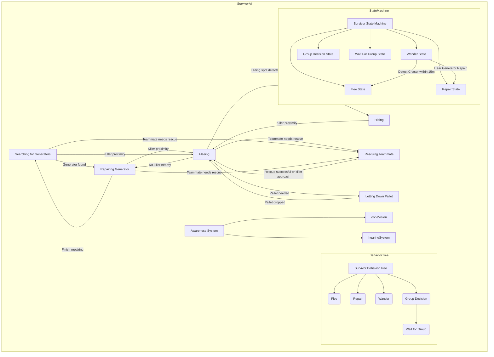
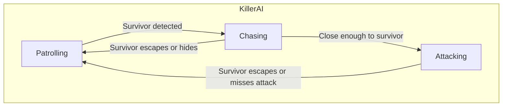

# ProyectoFinal 

## Autores
- Nanxi Qin ([NanxiQin](https://github.com/NanxiQin))
- Jianuo Wen Hu ([Jjianuo](https://github.com/Jjianuo))

## Propuesta
<p align="justify">
Este es el proyecto final de la asignatura de Inteligencia Artificial para Videojuegos del Grado en Desarrollo de Videojuegos de la UCM.
</p>

- [Alive by night-time]
<p align="justify">
Este proyecto consiste en una competicion entre dos bandos, los supervivientes y el asesino. 
  Los supervivientes deben intentar escapar de la mansión.
  El asesino debe intentar matar a los supervivientes antes de que consigan escapar 

El juego cuenta con los siguientes comportamientos:
</p>
<p align="justify">  
  
### Supervivientes
- Los supervivientes deben salir de la mansión, para esto deberán reparar una cantidad N de generadores repartidos por el mapa. Es controlado por un árbol de comportamiento complejo.
- Los supervivientes pueden comunicarse entre ellos para enviar información relevante.
- Los generadores tardan un tiempo T en ser reparados, los supervivientes no pueden moverse mientras estan reparando un generador.
- Una vez reparados todos los generadores o cuando sólo queda un superviviente, las puertas pueden ser desbloqueadas
- Para desbloquear una puerta, los supervivientes tardan un tiempo T, los supervivientes no pueden moverse mientras desbloquean la puerta.
- Los supervivientes atrapados en un gancho no pueden moverse hasta que les rescata otro superviviente.
- Los supervivientes mueren tras estar un tiempo X enganchados, o tras ser enganchados X veces.

### Asesino
- El asesino patrulla y ataca a cualquier superviviente en su cercanía.
- Cuando el asesino da X número de golpes a un superviviente, el superviviente es teletransportado a uno de los ganchos.
- El asesino tiene un mapa de influencia que va variando según cambia el estado del juego (Número y disposición de generadores, estado de los supervivientes, ganchos...)
  
(Opcionales)
- Los armarios permiten a los supervivientes ocultarse del asesino.
- El asesino puede abrir armarios para encontrar a un superviviente, en cuyo caso son dañados
</p>

## Punto de partida
Se parte de un proyecto base de **John Lemon's Haunted Jaunt: 3D Beginner** [https://learn.unity.com/project/john-lemon-s-haunted-jaunt-3d-beginner].

El proyecto sólo se ha cogido para la parte estética del juego, los scripts han sido todos implementados por los estudiantes.
Se han usado también otros assets encontrados por internet.

## Estrategias

Desarrollar estrategias para la toma de decisiones adaptativa, que permitan a los agentes de inteligencia artificial ajustar sus tácticas en respuesta a las cambiantes condiciones del juego,

- Priorizar objetivos basados en factores como proximidad, estado de salud y acciones.

### Sobreviviente

- Si el asesino está persiguiendo a varios, cada uno va a direcciones distintas para facilitar el escape.
- Si solo quedan 2 jugadores, o los 3 restos están enganchados, ya no intentan rescatarles y priorizan reparar generadores o esconderse.

### Asesino

- Perseguir al sobreviviente más cercano

## Multicapa

Comunicación:

1. Los sobrevivientes pueden compartir información sobre la ubicación del asesino, el progreso de la reparación de generadores y cualquier necesidad de asistencia.

### Event

En este ejemplo, EventManager gestiona eventos personalizados, y SurvivorAI se suscribe a estos eventos y define métodos manejadores para responder a ellos. Cuando se desencadena un evento, como un evento de encontrar generador, EventManager envía el evento, y todos los scripts de IA de sobrevivientes suscritos reciben y manejan el evento de acuerdo a ello.

```
using UnityEngine;
using UnityEngine.Events;

// Define custom events
public class GeneratorFoundEvent : UnityEvent<Vector3> { }
public class KillerProximityEvent : UnityEvent<Vector3> { }
public class TeammateRescueEvent : UnityEvent<Vector3> { }

public class EventManager : MonoBehaviour
{
    // Define singleton instance
    public static EventManager instance;

    // Define events
    public GeneratorFoundEvent onGeneratorFound;
    public KillerProximityEvent onKillerProximity;
    public TeammateRescueEvent onTeammateRescue;

    private void Awake()
    {
        // Ensure only one instance exists
        if (instance == null)
            instance = this;
        else if (instance != this)
            Destroy(gameObject);

        // Initialize events
        onGeneratorFound = new GeneratorFoundEvent();
        onKillerProximity = new KillerProximityEvent();
        onTeammateRescue = new TeammateRescueEvent();
    }
}

public class SurvivorAI : MonoBehaviour
{
    private void Start()
    {
        // Subscribe to events
        EventManager.instance.onGeneratorFound.AddListener(OnGeneratorFound);
        EventManager.instance.onKillerProximity.AddListener(OnKillerProximity);
        EventManager.instance.onTeammateRescue.AddListener(OnTeammateRescue);
    }

    private void OnGeneratorFound(Vector3 position)
    {
        // Handle generator found event
    }

    private void OnKillerProximity(Vector3 position)
    {
        // Handle killer proximity event
    }

    private void OnTeammateRescue(Vector3 position)
    {
        // Handle teammate rescue event
    }
}
```

## Pathfinding

## Diseño de la solución

Se usarán **árboles de comportamiento** para la toma de decisiones

Los índices mostrados a continuación son relativos al apartado del enunciado al que hacen referencia.

A.Mundo virtual:

B.Supervivientes:

### Diagarma:



### Estados:
| Estado | Comportamiento | Condición |	Transición |
| ------------- | ------------- | ------------- | ------------- |
| Buscando máquinas	| El sobreviviente busca activamente generadores para reparar. |	El sobreviviente no está ocupado reparando, huyendo, escondiéndose o rescatando.| - Transición al estado de Reparación de Generadores si se encuentra un generador. <br> - Transición de regreso al estado de Huida si el asesino está cerca. |
| Reparación de máquinas | El sobreviviente repara un generador. | - El generador no está completamente reparado. <br> - El asesino no está cerca. <br> - El sobreviviente está dentro del rango de un generador. | - Transición al estado de Huida si el asesino se acerca demasiado. <br> - Transición de regreso al estado de Buscando Generadores si no hay más generadores para reparar. |
| Huida	| El sobreviviente intenta escapar del asesino. |	- El asesino está dentro de una cierta proximidad. <br> - El sobreviviente no está ocupado actualmente reparando, rescatando o buscando. | - Transición al estado de Escondite si se detecta un lugar adecuado para esconderse. <br> - Transición al estado de Rescate de Compañero si un compañero de equipo necesita ser rescatado. <br> - Transición de regreso al estado de Buscando Generadores si el asesino ya no está cerca. |
| Escondite	| El sobreviviente se esconde del asesino |	Se detecta un lugar adecuado para esconderse (por ejemplo, armario, follaje) sin entrar en visión del asesino. | - Transición de regreso al estado de Huida si el asesino ya no está cerca. |
| Rescate de Compañero | El sobreviviente intenta rescatar a un compañero de equipo enganchado. | El compañero de equipo enganchado está dentro del rango. <br> El asesino no está cerca. | -	Transición de regreso al estado de Huida si el intento de rescate falla o si el asesino se acerca.|
| Soltar Pallet (opcional) |	El sobreviviente suelta un pallet para bloquear el camino del asesino. | El asesino está en persecución cercana. <br> El pallet está disponible para su uso. | - Transición de regreso al estado de Huida después de que se suelta el pallet. |

### Codigo:
```
public class SurvivorStateMachine : FSM {
    // Define states
    public SurvivorRepairState repairState;
    public SurvivorFleeState fleeState;
    public SurvivorHideState hideState;

    // Initialize states and transitions
    public SurvivorStateMachine() {
        repairState = new SurvivorRepairState(this);
        fleeState = new SurvivorFleeState(this);
        hideState = new SurvivorHideState(this);

        AddTransition(repairState, new RepairToHideTransition(hideState));
        // Add more transitions as needed
    }
}
// Example code for survivor pathfinding
public class SurvivorPathfinding {
    public List<Vector3> CalculatePath(Vector3 start, Vector3 end) {
        // Implement A* algorithm here
    }
}
```


C.Generadores:

C.Asesino:

### Diagrama:



### Estados:

| Estado | Comportamiento | Condición |	Transición |
| ------------- | ------------- | ------------- | ------------- |
| Merodear | El asesino patrulla el mapa en busca de sobrevivientes. |	No hay sobrevivientes dentro de una cierta proximidad. | - Transición al estado de Persecución si se detecta a un sobreviviente. |
| Persecución | El asesino persigue activamente a un sobreviviente. | El sobreviviente está dentro del rango de persecución. | - Transición al estado de Ataque si el asesino alcanza al sobreviviente. <br> - Transición de regreso al estado de Patrullaje si el sobreviviente escapa o se esconde con éxito. |
| Ataque | El asesino ataca al sobreviviente. |	El sobreviviente está dentro del rango de ataque. | - Transición de regreso al estado de Patrullaje si el sobreviviente escapa o si el asesino falla el ataque. |
| Romper Pallets(opcional) | El asesino rompe los pallets dejados por los sobrevivientes. | El pallet está dentro del rango y tiene un coste menor. | - Transición de regreso al estado de Patrullaje después de que el pallet sea destruido. |  

### Código:
```
public class KillerStateMachine : FSM {
    // Define states
    public KillerPatrolState patrolState;
    public KillerChaseState chaseState;
    public KillerAttackState attackState;

    // Initialize states and transitions
    public KillerStateMachine() {
        patrolState = new KillerPatrolState(this);
        chaseState = new KillerChaseState(this);
        attackState = new KillerAttackState(this);

        AddTransition(patrolState, new PatrolToChaseTransition(chaseState));
        // Add more transitions as needed
    }
}
```

E.Ganchos:

### Diseño del nivel


## Pruebas y métricas
### Pruebas
A.Mundo virtual:

B.Supervivientes:

D.Generadores:

C.Asesino:

E.Ganchos:

- [Vídeo con la batería de pruebas](https://youtu.be/)

____________________________________________________________________________________________________________________________________________________________________
### Métricas

_Las métricas se han realizado con todos los scripts activados, con movimiento de jugador con teclado en el ejecutable._

Ordenador de la FDI (Procesador 12th Gen Intel Core i7-12700, 32GB RAM, RTX 2060)

| Tamaño del mapa | Supervivientes | FPS |
| ------------- | ------------- | ------------- |


Ordenador de miembro 1 (Procesador 13th Gen Intel Core i5-13600K, 32GB RAM, RX 7800XT)

| Tamaño del mapa | Supervivientes | FPS |
| ------------- | ------------- | ------------- |


Ordenador de miembro 2 (AMD Ryzen 7 4800H, 16GB RAM, RTX 2060)

| Tamaño del mapa | Supervivientes | FPS |
| ------------- | ------------- | ------------- |

## Producción
<p align="justify">
Para el correcto desarrollo de la práctica el reparto de tareas y el seguimiento de las mismas se realizará utilizando como herramienta las issues de github desde la pestaña de Projects.
El enlace desde el que por tanto se podrá hacer el seguimiento de la evolución del proyecto así como la organización del mismo es el siguiente: 
</p>

- [https://github.com/orgs/IAV24-Qin-Wen/projects/1](https://github.com/orgs/IAV24-Qin-Wen/projects/1)
<p align="justify">
Además, obsérvese que dentro de la pestaña de project las distintas tareas tienen asignadas distintas labels y descripciones para poder comprender con mayor facilidad la tarea concreta a la que hacen referencia.
</p>

## Licencia
<p align="justify">
Nanxi Qin y Jianuo Wen, autores de la documentación, código y recursos de este trabajo, concedemos permiso permanente a los profesores de la Facultad de Informática de la Universidad Complutense de Madrid para utilizar nuestro material, con sus comentarios y evaluaciones, con fines educativos o de investigación; ya sea para obtener datos agregados de forma anónima como para utilizarlo total o parcialmente reconociendo expresamente nuestra autoría.
</p>
<p align="justify">
Una vez superada con éxito la asignatura se prevee publicar todo en abierto (la documentación con licencia Creative Commons Attribution 4.0 International (CC BY 4.0) y el código con licencia GNU Lesser General Public License 3.0).
</p>

## Referencias

Los recursos de terceros utilizados son de uso público.

- *AI for Games*, Ian Millington.
- UnityLearn(https://learn.unity.com/project/john-lemon-s-haunted-jaunt-3d-beginner).

