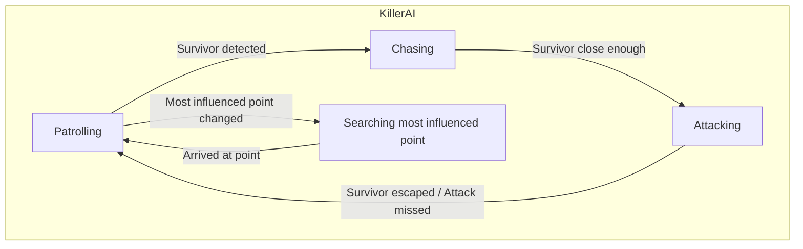
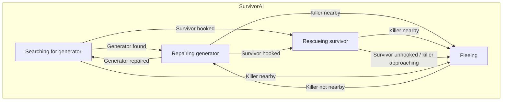

# Final proyect : [Alive by night-time]

## Authors
- Nanxi Qin ([NanxiQin](https://github.com/NanxiQin))
- Jianuo Wen Hu ([Jjianuo](https://github.com/Jjianuo))

## Proposal
<p align="justify">
This is the final project for the Artificial Intelligence for Video Games course in the Game Development degree at UCM in 2024.
</p>


<p align="justify">
The project is a competition between two sides: the survivors and the killer. 
  The survivors must try to escape from the mansion, while the killer must try to kill the survivors before they escape.
  
The game includes the following behaviors:

</p>
<p align="justify">  

### Summary:
New implementations include influence maps and AI communication. Elements learned and used in previous exercises, such as patrolling, senses, and the navigation mesh, will also be utilized.

### A. Scene
- It is a 3D virtual world with a number of **generators** (machines with green light) and **hooks** (hooks with red light) scattered across the map.
- Once all generators are repaired, the escape door can be unlocked.
- Initially, survivors spawn randomly on the map, while the killer always starts from the same location.
- The **camera can be moved** using the WASD keys and zoomed with Q and E.
- The camera mode can be toggled between perspective and orthogonal top-down view with the Ctrl key.
- The influence map can be visually observed, with areas influenced by generators in green and by hooks in red.
- The game ends when 2 survivors escape or fewer than 2 survivors remain alive.

### B. Generators
- They have a progress bar indicating the repair progress.
- The more repaired a generator is, the more it influences the influence map.
- Once fully repaired, it stops influencing the map.

### C. Hooks
- They have a progress bar indicating the progress of the hooked survivor's death, visible only when a survivor is hooked.
- The more progressed, the more it influences the influence map.
- Once the progress is complete or there are no hooked survivors, it stops influencing the map.

### D. Killer
- The killer has an influence map that changes as the game progresses (number and location of generators, state of hooks, etc.). When a change is detected in the most influenced area, the killer moves directly there and patrols.
- The killer's behavior is controlled by a behavior tree.
- The killer patrols the map otherwise.
- Upon discovering survivors, the killer chases the nearest one, increasing speed, until within attack range, and attempts to attack.
- If the survivor is lost from sight for 2 seconds, the killer stops chasing.
- The killer can damage all survivors within the attack area.
- Whether or not the attack hits, there is a cooldown period before the killer can move again.
- The killer's vision cone and attack area are visually represented.

### E. Survivors
- Survivors can communicate to share relevant information (discovered a new generator, needs help, etc.).
- Survivors must escape the mansion by repairing a number of generators scattered across the map, controlled by a complex behavior tree.
- Generators take time T to repair, and survivors cannot move while repairing.
- Survivors escape through the door once it's unlocked.
- When hit, survivors are teleported to one of the available hooks.
- Hooked survivors cannot move until rescued by another survivor.
- Survivors die after being hooked for time X or after being hooked Y times.

</p>

## Starting Point

- The project is based on John Lemon's Haunted Jaunt: 3D Beginner for aesthetics (models, sounds, animations), with all scripts implemented by the students. Other free assets found online were also used.

- The Behavior Designer tool and some pre-existing scripts were used for the implementation of the behavior tree. The most important scripts are:

| Class | Description | 
| ------------- | ------------- |
| **Seek** | Pursues a specified target using Unity's NavMesh with pathfinding via A*. |
| **Pursue** | Similar to Seek with added prediction based on the target's distance and speed. |
| **Wander** | Roams around using Unity's NavMesh with random movement within configured distance and angle parameters.|
<br>

- For the influence map, scripts from an influence map (threaded).unitypackage project from the Unity forum were used. This influence map divides the world into an N*M 2D grid. Each cell has a value representing the sum of influences from various sources.

<br>

| Class  | Description | Main parameters | Main methods |
| ------------- | ------------- | ------------- | ------------- |
| **MapServer** | Abstract class for the influence map, simulating influence propagation. | **- _influenceMap:** Object representing the influence map.<br> | **- GetGridPosition(Vector3 pos):** Converts a world position to grid coordinates within the influence map.<br> **- GetInfluence(Vector2I position):** Gets the influence at a given map position.<br> **- GetGridLength():** Gets the map's grid length.<br> **- SetInfluence(Vector2I pos, float value):** ets the influence at a specific map position.<br> |
| **InfluenceMapControl** | Manages an influence map, including creation, updates, and management of propagators and obstacles. | **- _display:** Grid display component.<br> **- _bottomLeft:** Bottom-left map corner transformation.<br> **- _upperRight:** op-right map corner transformation.<br> **- _gridSize:** Grid size of the map.<br> **- _decay:** Influence decay factor.<br> **- _momentum:** Influence momentum factor.<br> | **- CreateMap():** Creates the influence map and sets up the display component.<br> **- RegisterPropagator(IPropagator p):** Registers an influence propagator on the map.<br> **- RegisterObstacle(InfluenceObstacle o):** Registers an obstacle on the influence map.<br> **- GetGridPosition(Vector3 pos):** Converts a world position to grid coordinates within the influence map.<br> **- SetInfluence(Vector2I pos, float value):** Sets the influence at a specific map position.<br> |
| **GridDisplay** | Creates the mesh that visually represents the influence map in the scene.| **- _material:** Material used for mesh visualization.<br> **- _neutralColor:** Color for neutral values.<br> **- _positiveColor:** Color for low positive values.<br> **- _negativeColor:** Color for low negative values. | **- SetGridData(IGridData m):** Sets the grid data for display.<br> **- CreateMesh(Vector3 bottomLeftPos, float gridSize):** Creates the mesh to visualize the influence map.<br> **- Update():** Updates mesh colors based on influence values. |

## Solution Design

### A. Scene:
#### 1. Level design


As shown on the image, there will be 1 killer, 4 survivors, 5 generators, 4 hooks and 1 door.

### D. Killer:

#### 1. State diagram:


#### 2. Behavior tree


#### 3. Influence map

##### a. Versions and testing
The original project for the influence map moved characters toward a direction based on the sum of influence values from 8 possible directions. However, this approach yielded unsatisfactory results for the killer. Despite parameter adjustments and added conditions, the character moved predictably and unintelligently, often staying in the same spot or moving between close points, which did not effectively convey patrolling behavior. <br>

After various tests, the current version has the killer using two influence maps that combine to determine the most relevant point. One map assesses generator influence, while the other focuses on hooks. Each frame, the most influenced point from the combined map is identified, representing either a generator or hook position. The point's value is calculated as X + Y, where X is the generator influence and Y is the hook influence. The killer heads to the most affected generator or hook and patrols from there. If the same point remains most influenced over consecutive frames, the killer continues on its original route, avoiding staying in one spot. <br>

##### b. Influence Relationship
To be more logical, generator influence is linearly proportional to repair progress, while hook influence and progress have an exponential relationship. The killer is more interested in monitoring the hook as a survivor approaches death. Additionally, the final hook influence is greater than that of a generator, as shown in the following image: <br>


- Why calculate the most influenced point among generators and hooks instead of a general map point? <br> <br>
Although other areas might have higher influence than generator and hook locations, these two elements are the primary focus for changes in influence: generator repairs or a survivor nearing death at a hook. Moreover, in the original game Dead By Daylight, the killer already knows the exact locations of generators and hooks from the start. Therefore, it makes sense for the killer to move toward these points and patrol until the next significant event occurs.

- Why calculate the most influenced point among generators and hooks instead of a general map point? <br> <br>
Although other areas might have higher influence than generator and hook locations, these two elements are the primary focus for changes in influence: generator repairs or a survivor nearing death at a hook. Moreover, in the original game "Dead By Daylight", the killer already knows the exact locations of generators and hooks from the start. Therefore, it makes sense for the killer to move toward these points and patrol until the next significant event occurs.

To aid in the map's visuallizaction, colors hace been assigned to hooks and generators. areas influenced bu generators are shown in green, while areas influenced by hooks are shown in red. <br>


### E. Survivors:
The following code is a very modified version of the "Seek" algorithm used in Behavior Bricks
Evade pseudocode:
```
# algorithm of Evasion
class EvadeWithWalls:
    # The agent has evaded when the magnitude is greater than this value
    evadeDistance: Float
    # The distance to look ahead when evading
    lookAheadDistance: Float
    # How far to predict the distance ahead of the target. Lower values indicate less distance should be predicated
    targetDistPrediction: Float
    # Multiplier for predicting the look ahead distance
    targetDistPredictionMult: Float
    # The GameObject that the agent is evading
    target: GameObject

    # The position of the GameObject that the agent is evading
    targetPosition: GameObject
    # The anglein which the agent goes towards to if it can't run away directly
    angle: Float

    function OnUpdate() -> Status
        if(distanceFromTarget > evadeDistance) return Success

        CalculatePath(Target())

        return running
```
```
# algorithm of CalculatePath

function CalculatePath()
    v = target - position
    v2 = v rotated angle degrees
    v3 = v rotated -angle degrees

    if(there is a path to v)
        SetDestination(v);
    else if(there is a path to v2)
        SetDestination(v2)
    else
        SetDestination(v3)
```
```
# algorithm of Target

function Target() -> Vector3
    distance = (target.position - position).magnitude
    speed = velocity.magnitude;

    futurePrediction = 0;
    // Set the future prediction to max prediction if the speed is too small to give an accurate prediction
    if (speed <= distance / targetDistPrediction) {
        futurePrediction = targetDistPrediction;
    } else {
        futurePrediction = (distance / speed) * targetDistPredictionMult; // the prediction should be accurate enough
    }

    // Predict the future by taking the velocity of the target and multiply it by the future prediction
    prevTargetPosition = targetPosition;
    targetPosition = target.position;
    auxPosition = targetPosition + (targetPosition - prevTargetPosition) * futurePrediction;

    return position + (position - auxPosition).normalized * lookAheadDistance;
```
The following code is a modified version of the "SendEvent" script used in Behavior BricksThe following code is a very modified version of the "Seek" algorithm used in Behavior Bricks
SendEvent pseudocode:
```
# algorithm of SendEventToSurvivors
class SendEventToSurvivors:
    # The event to send
    eventName: String
    # The group of the behavior tree that the event should be sent to
    group: Int
    # The survivors
    survivors: GameObject

fuction OnUpdate() -> Status
    if (behaviorTrees == null)
        return TaskStatus.Failure;
    else
        foreach(survivor) SendEvent(EventName)
```
#### 1. State diagram:



#### 2. Behavior tree


#### 3. Cooperation
- Survivors can share information about the killer's location, found generators and their progress and their location if they get hooked.
- Due to the sharing of information and decision-making that considers team members, emergent cooperation among the survivors may sometimes appear. The shared information allows the survivors to seem coordinated, even though the game would function the same if one were lost.
- To synchronize, signals or event waits are also used.
- Information about the generators (position, progress, completion, etc.) is stored in a common list accessible to all survivors.
- When a generator is found, each survivor decides whether to go to it based on their distance or if they are already repairing another generator.
- When a survivor is hooked, an event is sent to all other survivors to inform them.
- A manager is used to facilitate communication between survivors, instantiating and storing references to the survivors.

## Testing and metrics
### Testing
A. Scene: 

A.1. Move the camera with WASD, zoom with Q and E, and switch modes with Ctrl. <br>
A.2. Wait for all generators to be repaired to check that the door unlocks. <br>
A.3. Reset the game multiple times to ensure that survivors spawn in different locations. <br>
A.4. Verify that the game ends if all survivors are hooked. <br>

B. Generators:

B.1. Wait for a survivor to repair the generator and check that its influence increases linearly. <br>
B.2. Wait for a generator to be fully repaired and ensure that it no longer influences the influence map. <br>
B.3. Place multiple survivors repairing the same generator to check that the repair speed is higher. <br> <br>

C. Hooks:

C.1. Wait for the killer to hit a survivor and verify that they are moved to a random hook and their influence increases exponentially. <br>
C.2. Wait for a hook to complete its progress and ensure that it no longer influences the influence map. <br>
C.3. Check that the progress bar resets correctly when a survivor is rescued. <br>

D. Killer:

D.1. Verify that the killer chases a survivor when they are within its line of sight. <br>
D.2. Confirm that the killer stops chasing if the survivor is lost from sight. <br>
D.3. Check that the killer attempts to attack when close enough to the survivor. <br>
D.3. Ensure that the killer moves to the new most influenced point on the map while patrolling. <br>

E. Survivors:

E.1. Check that the survivors wander around the map looking for generators. <br>
E.2. Verify that survivors go to repair a generator if they are not being chased. <br>
E.3. Confirm that a survivor goes to a generator even if they haven't seen it themselves, based on information from another survivor. <br>
E.4. Ensure that survivors go to rescue hooked survivors if they are not being chased. <br>
E.5. Check that survivors are inactive when hooked. <br>
E.6. Verify that survivors flee from the killer when nearby and in line of sight. <br>
E.7. Confirm that survivors head to the exit once it is unlocked. <br>

- [Video with the test suite](https://youtu.be/61pVqBo8jkA)

____________________________________________________________________________________________________________________________________________________________________
### Metrics

The metrics were measured with all scripts active, including player movement in the executable. <br>

Member 1's Computer: (13th Gen Intel Core i5-13600K, 32GB RAM, RX 7800XT) <br>
FPS: 54 <br>

Member 2's Computer: (AMD Ryzen 7 4800H, 16GB RAM, RTX 2060) <br>
FPS: 52 <br>

## Production
<p align="justify">
To ensure proper development, task distribution and tracking will be managed using GitHub issues from the Projects tab. The progress and organization of the project can be followed at the following link:
</p>
- [https://github.com/orgs/IAV24-Qin-Wen/projects/1](https://github.com/orgs/IAV24-Qin-Wen/projects/1)
<p align="justify">
Additionally, within the Projects tab, various tasks are assigned different labels to clearly identify the specific task they refer to.
</p>


### Task Distribution
#### Nanxi Qin:
- Asset search. <br>
- Camera mode, movement, and zoom. <br>
- Progress bars for generators and hooks. <br>
- HUD (status of survivors and the killer). <br>
- Level design. <br>
- Endgame management (door unlocking, winning by killer or survivors, level reset). <br>
- Influence map for generators and hooks. <br>
- Killer: <br>
    &emsp; - Animation management. <br>
    &emsp; - Chasing. <br>
    &emsp; - Abandonment of chase after losing sight. <br>
    &emsp; - Attack. <br>
    &emsp; - Finding the most affected area on the influence map. <br>
    &emsp; - Patrolling. <br>
- Survivors: <br>
    &emsp; - Taking damage when attacked by the killer and being randomly relocated to a hook and immobilized. <br>
    &emsp; - Dying after being attacked a second time or after hook progress completion. <br>
#### Jianuo Wen:
- On-screen FPS display. <br>
- Survivors: <br>
&emsp; - Random spawning for survivors. <br>
&emsp; - Generator repair. <br>
&emsp; - Detection of unseen generators. <br>
&emsp; - Moving to the nearest found generator. <br>
&emsp; - Communication with survivors upon finding a generator, being hooked, and repairing all generators. <br>
&emsp; - Evasion from the killer when nearby. <br>
&emsp; - Evasion script that also avoids walls. <br>
&emsp; - Rescue of hooked survivors. <br>
&emsp; - Fleeing to the door when all generators are repaired. <br>
&emsp; - Wandering. <br>
&emsp; - Animation management. <br>
&emsp; - Sending events to survivors. <br>

In summary, Nanxi Qin will primarily handle the design of the killer, including behaviors and animations, and the development of the influence map. Jianuo Wen will focus on the survivors, addressing behaviors, animations, and communication among them. However, there will be mutual collaboration on tasks to ensure smooth interaction between survivors and the killer. Additionally, task difficulty variability will lead to different responsibilities for each member.

</p>

## License

<p align="justify">
License
Nanxi Qin and Jianuo Wen, authors of the documentation, code, and resources of this work, grant permanent permission to the professors of the Faculty of Informatics at the Complutense University of Madrid to use our material, with their comments and evaluations, for educational or research purposes; either to obtain aggregated anonymous data or to use it in whole or in part while expressly recognizing our authorship.
</p>
<p align="justify">
Upon successful completion of the course, we plan to publish everything openly (documentation under the Creative Commons Attribution 4.0 International (CC BY 4.0) license and code under the GNU Lesser General Public License 3.0).
</p>

## References

Third-party resources used are for public use.

- *AI for Games*, Ian Millington.
    - 3.2.1 "Seek", 52.
    - 3.2.2 "Wandering", 55.
    - 3.3.3 "Seek and Flee", 58.
    - 3.3.4 "Arrive", 62.
    - 3.3.8 "Pursue and Evade", 68.
    - 3.3.13 "Separation", 82.
    - 6.2.2 "Simple Influence Maps", 500.
    - 6.4.2 "Emergent Cooperation", 551
- UnityLearn[https://learn.unity.com/project/john-lemon-s-haunted-jaunt-3d-beginner].
- Behavior Designer [https://assetstore.unity.com/packages/tools/visual-scripting/behavior-designer-behavior-trees-for-everyone-15277].
- Influence map (threaded).unitypackage [https://forum.unity.com/threads/ai-influence-maps.145368/].
