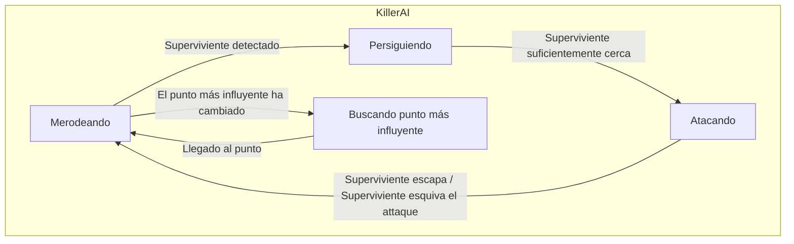
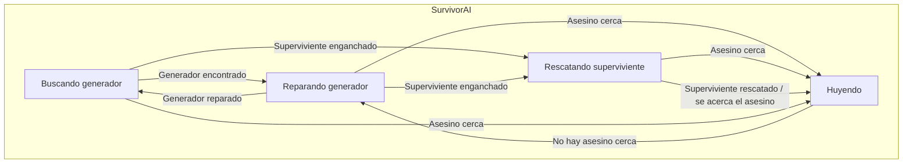

# ProyectoFinal : [Alive by night-time]

## Autores
- Nanxi Qin ([NanxiQin](https://github.com/NanxiQin))
- Jianuo Wen Hu ([Jjianuo](https://github.com/Jjianuo))

## Propuesta

Este es el proyecto final de la asignatura de Inteligencia Artificial para Videojuegos del Grado en Desarrollo de Videojuegos de la UCM en 2024.

Este proyecto consiste en una competición entre dos bandos, los supervivientes y el asesino. 
  Los supervivientes deben intentar escapar de la mansión.
  El asesino debe intentar matar a los supervivientes antes de que consigan escapar 

El juego cuenta con los siguientes comportamientos:

  
### Resumen:
Las cosas nuevas que se van a implementear van a ser los mapas de influencia y la comunicación entre IAs.
También se usarán cosas de las prácticas anteriores como el merodeo, los sentidos, las mallas de navegación...

### A. Escena
- Es un mundo virtual 3D en donde están distribuidos una cantidad N de **generadores** (máquinas con luz verde) y una cantidad M de **ganchos** (ganchos con luz roja) repartidos por el mapa.
- Tanto los generadores como los ganchos tienen una **barra de progreso**, para indicar el progreso de reparacion y el progreso para morir, respectivamente.
- Inicialmente, los supervivientes se spawnean de forma aleatoria en un punto del mapa, mientras que el asesino siempre empieza desde un mismo lugar.
- La **cámara se mueve** con las teclas WASD y se hace zoom con Q y E.
- Se puede alternar el modo de cámara entre perspectiva y ortogonal vista cenital con la tecla Ctrl.
- Se puede observar visualmente el mapa de influencias afectado por los generadores, en color verde, y por los ganchos, en color rojo.

### D. Asesino
- El asesino tiene un **mapa de influencia** que va variando según cambia el estado del juego (número y disposición de generadores, estado de los ganchos, ...), de tal manera que cada vez que detecte un cambio en el lugar más influido
del mapa, irá directamente a ese sitio y merodeará desde allí.
- El comportamiento del asesino está controlado por un **árbol de comportamiento**.
- El asesino **merodea** por el mapa en el resto del tiempo.
- Cuando descubre a los supervivientes, **persigue** ,aumentando su velocidad, al más cercano hasta que esté en su alcance e intenta atacar.
- Cuando intenta atacar, da igual si ha podido golpear al superviviente o no, tiene un tiempo de recuperación para volver a moverse.
- Se muestra visualmente su área de visión (pirámide) y área de ataque (esfera).

### E. Supervivientes
- Los supervivientes pueden **comunicarse entre ellos** para enviar información relevante (han descubierto un nuevo generador, ha sido atrapado y necesita ayuda...).
- Los supervivientes deben salir de la mansión, para esto deberán **reparar** una cantidad N de generadores repartidos por el mapa. Es controlado por un **árbol de comportamiento** complejo.
- Los generadores tardan un tiempo T en ser reparados, los supervivientes no pueden moverse mientras estan reparando un generador.
- Una vez reparados todos los generadores las puertas pueden ser desbloqueadas.
- Para desbloquear una puerta, los supervivientes tardan un tiempo T, los supervivientes no pueden moverse mientras desbloquean la puerta.
- Cuando un superviviente ha sido golpeado, se teletransporta a uno de los ganchos disponibles.
- Los supervivientes atrapados en un gancho no pueden moverse hasta que les rescata otro superviviente.
- Los supervivientes mueren tras estar un tiempo X enganchados, o tras ser enganchados Y veces.

## Punto de partida

- Se parte de un proyecto base de **John Lemon's Haunted Jaunt: 3D Beginner** [https://learn.unity.com/project/john-lemon-s-haunted-jaunt-3d-beginner].

El proyecto sólo se ha cogido para la parte estética del juego (modelos, sonidos, animaciones), los scripts han sido todos implementados por los estudiantes.
Se han usado también otros assets gratis encontrados por internet.

- Para la implementación del árbol de comportamiento, se ha usado la herramienta **Behavior Designer** [https://assetstore.unity.com/packages/tools/visual-scripting/behavior-designer-behavior-trees-for-everyone-15277] y parte de los scripts ya creados por este. Los más importantes son:

| Clase  | Descripción | 
| ------------- | ------------- |
| **Seek** | Persigue el objetivo especificado utilizando el NavMesh de Unity calculando el camino con A*. |
| **Pursue** | Igual que Seek más el uso de predicción según la distancia al objetivo y su propia velocidad. |
| **Flee** | Huir del objetivo usando las mismas técnicas que Pursue pero calculando la dirección contraria. |
| **Wander** | Merodea utilizando el NavMesh de Unity con un movimiento continuo y aleatorio. Cada cierto tiempo intenta establecer un nuevo destino dentro de los parámetros configurados para la distancia y el ángulo de deambulación máximos.|
 

- Para el mapa de influencias, se parte de unos scripts de un proyecto **influence map (threaded).unitypackage** del foro de Unity [https://forum.unity.com/threads/ai-influence-maps.145368/].
Este mapa de influencias trata de dividir el mundo en N*M casillas en 2D. Cada casilla tendrá un valor que será la suma de todos los valores de los propagadores que influyen a dicho mapa.
Las clases principalmente son:

 

| Clase  | Descripción | Parámetros principales | Métodos principales |
| ------------- | ------------- | ------------- | ------------- |
| **MapServer** | Es la clase abstracta para el mapa de influencia, utilizado para simular la propagación de influencia en un entorno determinado. | **- _influenceMap:** Objeto que representa el mapa de influencia.  | **- GetGridPosition(Vector3 pos):** Convierte una posición del mundo en coordenadas de cuadrícula dentro del mapa de influencia.  **- GetInfluence(Vector2I position):** Obtiene la influencia en una posición dada del mapa.  **- GetGridLength():** Obtiene la longitud de la cuadrícula del mapa.  **- SetInfluence(Vector2I pos, float value):** Establece la influencia en una posición específica del mapa.  |
| **InfluenceMapControl** | Controla un mapa de influencia, incluyendo su creación, actualización y gestión de objetos propagadores y obstáculos. | **- _display:** Componente de visualización de cuadrícula.  **- _bottomLeft:** Transformación de la esquina inferior izquierda del mapa.  **- _upperRight:** Transformación de la esquina superior derecha del mapa.  **- _gridSize:** Tamaño de la cuadrícula del mapa.  **- _decay:** Factor de decaimiento de la influencia.  **- _momentum:** Factor de impulso de la influencia.  | **- CreateMap():** Crea el mapa de influencia y configura el componente de visualización.  **- RegisterPropagator(IPropagator p):** Registra un propagador de influencia en el mapa.  **- RegisterObstacle(InfluenceObstacle o):** Registra un obstáculo en el mapa de influencia.  **- GetGridPosition(Vector3 pos):** Convierte una posición del mundo en coordenadas de cuadrícula dentro del mapa de influencia.  **- SetInfluence(Vector2I pos, float value):** Establece la influencia en una posición específica del mapa.  |
| **GridDisplay** | Se encarga de crear la malla que mostrará el mapa de influencia en escena visualmente.| **- _material:** material utilizado para la visualización de la malla.  **- _neutralColor:** color para los valores neutrales.  **- _positiveColor:** color para los valores positivos bajos.  **- _negativeColor:** color para los valores negativos bajos. | **- SetGridData(IGridData m):** establece los datos de la cuadrícula para la visualización.  **- CreateMesh(Vector3 bottomLeftPos, float gridSize):** crea la malla para visualizar el mapa de influencia.  **- Update():** actualiza los colores de la malla en función de los valores de influencia. |

## Diseño de la solución

Los índices mostrados a continuación son relativos al apartado del enunciado al que hacen referencia.

### A. Escena:
#### 1. Diseño de nivel
Como se muestra en la imagen, habra 1 asesino, 4 supervivientes, 5 generadores, 4 ganchos y 1 puerta.

### D. Asesino:

#### 1. Diagrama de los estados:

#### 2. Arbol de comportamiento

#### 3. Mapa de influencia
El asesino tiene varios mapas de influencia que determinan la zona por la que va a patrullar. Los distintos mapas de influencia se combinan para determinar el punto más importante

### E. Supervivientes:

#### 1. Diagrama de los estados:

#### 2. Arbol de comportamiento

#### 3. Cooperación
 Los supervivientes pueden compartir información sobre la ubicación del asesino, los generadores encontrados y su progreso y su localización en caso de ser atrapado. Debido a la compartición de información y a la toma de decisiones que tiene en cuenta a los compañeros de equipo, en ocasiones se conseguirá que aparezca una cooperación emergente entre los NPCs. La información compartida hace que los NPCs aparentan corrdinarse, aunque si se perdiese uno funcionaría igual. Para sincronizarse se usan además envío y esperas de señales o eventos. 
## Pruebas y métricas
### Pruebas
A.Mundo virtual:

B.Ganchos:

C.Generadores:

D.Asesino:

E.Supervivientes:

- [Vídeo con la batería de pruebas](https://youtu.be/)

____________________________________________________________________________________________________________________________________________________________________
### Métricas

_Las métricas se han realizado con todos los scripts activados, con movimiento de jugador con teclado en el ejecutable._

Ordenador de miembro 1 (Procesador 13th Gen Intel Core i5-13600K, 32GB RAM, RX 7800XT)

| Tamaño del mapa | Supervivientes | FPS |
| ------------- | ------------- | ------------- |

Ordenador de miembro 2 (AMD Ryzen 7 4800H, 16GB RAM, RTX 2060)

| Tamaño del mapa | Supervivientes | FPS |
| ------------- | ------------- | ------------- |

## Producción

Para el correcto desarrollo de la práctica el reparto de tareas y el seguimiento de las mismas se realizará utilizando como herramienta las issues de github desde la pestaña de Projects.
El enlace desde el que por tanto se podrá hacer el seguimiento de la evolución del proyecto así como la organización del mismo es el siguiente: 

- [https://github.com/orgs/IAV24-Qin-Wen/projects/1](https://github.com/orgs/IAV24-Qin-Wen/projects/1)

Además,dentro de la pestaña de project las distintas tareas tienen asignadas distintas labels para poder comprender con mayor facilidad la tarea concreta a la que hacen referencia.

## Licencia

Nanxi Qin y Jianuo Wen, autores de la documentación, código y recursos de este trabajo, concedemos permiso permanente a los profesores de la Facultad de Informática de la Universidad Complutense de Madrid para utilizar nuestro material, con sus comentarios y evaluaciones, con fines educativos o de investigación; ya sea para obtener datos agregados de forma anónima como para utilizarlo total o parcialmente reconociendo expresamente nuestra autoría.

Una vez superada con éxito la asignatura se prevee publicar todo en abierto (la documentación con licencia Creative Commons Attribution 4.0 International (CC BY 4.0) y el código con licencia GNU Lesser General Public License 3.0).

## Referencias

Los recursos de terceros utilizados son de uso público.

- *AI for Games*, Ian Millington.
- UnityLearn(https://learn.unity.com/project/john-lemon-s-haunted-jaunt-3d-beginner).

