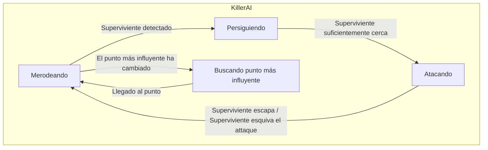
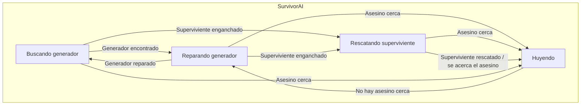

# ProyectoFinal : [Alive by night-time]

## Autores
- Nanxi Qin ([NanxiQin](https://github.com/NanxiQin))
- Jianuo Wen Hu ([Jjianuo](https://github.com/Jjianuo))

## Propuesta
<p align="justify">
Este es el proyecto final de la asignatura de Inteligencia Artificial para Videojuegos del Grado en Desarrollo de Videojuegos de la UCM en 2024.
</p>


<p align="justify">
Este proyecto consiste en una competición entre dos bandos, los supervivientes y el asesino. 
  Los supervivientes deben intentar escapar de la mansión.
  El asesino debe intentar matar a los supervivientes antes de que consigan escapar 

El juego cuenta con los siguientes comportamientos:
</p>
<p align="justify">  
  
### Resumen:
Las cosas nuevas que se van a implementear van a ser los mapas de influencia y la comunicación entre IAs.
También se usarán cosas aprendidas y usadas en las prácticas anteriores como el merodeo, los sentidos, la malla de navegación...

### A. Escena
- Es un mundo virtual 3D en donde están distribuidos una cantidad N de **generadores** (máquinas con luz verde) y una cantidad M de **ganchos** (ganchos con luz roja) repartidos por el mapa.
- Una vez reparados todos los generadores la puerta escapatoria puede ser desbloqueadas.
- Inicialmente, los supervivientes se spawnean de forma aleatoria en un punto del mapa, mientras que el asesino siempre empieza desde un mismo lugar.
- La **cámara se mueve** con las teclas WASD y se hace zoom con Q y E.
- Se puede alternar el modo de cámara entre perspectiva y ortogonal vista cenital con la tecla Ctrl.
- Se puede observar visualmente el mapa de influencias afectado por los generadores, en color verde, y por los ganchos, en color rojo.

### B. Generadores
- Tiene una barra de progreso, para indicar el progreso de reparación.
- Cuanto mayor sea su progreso, más influirá en el mapa de influencias.
- Cuando su progreso se complete, dejará de influir en el mapa.
  
### C. Ganchos
- Tiene una barra de progreso para indicar el progreso de muerte del superviviente enganchado. Solo se muestra esta barra cuando hay uno enganchado.
- Cuanto mayor sea su progreso, más influirá en el mapa de influencias.
- Cuando su progreso se complete o cuando no haya supervivientes, dejará de influir en el mapa.
  
### D. Asesino
- El asesino tiene un **mapa de influencia** que va variando según cambia el estado del juego (número y disposición de generadores, estado de los ganchos, ...), de tal manera que cada vez que detecte un cambio en el lugar más influido
del mapa, irá directamente a ese sitio y merodeará desde allí.
- El comportamiento del asesino está controlado por un **árbol de comportamiento**.
- El asesino **merodea** por el mapa en el resto del tiempo.
- Cuando descubre a los supervivientes, **persigue** ,aumentando su velocidad, al más cercano hasta que esté en su alcance e intenta atacar.
- Cuando intenta atacar, da igual si ha podido golpear al superviviente o no, tiene un tiempo de recuperación para volver a moverse.
- Se muestra visualmente su área de visión (pirámide) y área de ataque (esfera).

### E. Supervivientes
- Los supervivientes pueden **comunicarse entre ellos** para enviar información relevante (han descubierto un nuevo generador, ha sido atrapado y necesita ayuda...).
- Los supervivientes deben salir de la mansión, para esto deberán **reparar** una cantidad N de generadores repartidos por el mapa. Es controlado por un **árbol de comportamiento** complejo.
- Los generadores tardan un tiempo T en ser reparados, los supervivientes no pueden moverse mientras estan reparando un generador.
- Cuando la puerta se desbloquea, los supervivientes escapan por alli.
- Cuando un superviviente ha sido golpeado, se teletransporta a uno de los ganchos disponibles.
- Los supervivientes atrapados en un gancho no pueden moverse hasta que les rescata otro superviviente.
- Los supervivientes mueren tras estar un tiempo X enganchados, o tras ser enganchados Y veces.

</p>

## Punto de partida

- Se parte de un proyecto base de **John Lemon's Haunted Jaunt: 3D Beginner**.

El proyecto sólo se ha cogido para la parte estética del juego (modelos, sonidos, animaciones), los scripts han sido todos implementados por los estudiantes.
Se han usado también otros assets gratis encontrados por internet.

- Para la implementación del árbol de comportamiento, se ha usado la herramienta **Behavior Designer** y parte de los scripts ya creados por este. Los más importantes son:


| Clase  | Descripción | 
| ------------- | ------------- |
| **Seek** | Persigue el objetivo especificado utilizando el NavMesh de Unity calculando el camino con A*. |
| **Pursue** | Igual que Seek más el uso de predicción según la distancia al objetivo y su propia velocidad. |
| **Wander** | Merodea utilizando el NavMesh de Unity con un movimiento continuo y aleatorio. Cada cierto tiempo intenta establecer un nuevo destino dentro de los parámetros configurados para la distancia y el ángulo de deambulación máximos.|
<br>

- Para el mapa de influencias, se parte de unos scripts de un proyecto **influence map (threaded).unitypackage** del foro de Unity .
Este mapa de influencias trata de dividir el mundo en N*M casillas en 2D. Cada casilla tendrá un valor que será la suma de todos los valores de los propagadores que influyen a dicho mapa.
Las clases principalmente son:

<br>

| Clase  | Descripción | Parámetros principales | Métodos principales |
| ------------- | ------------- | ------------- | ------------- |
| **MapServer** | Es la clase abstracta para el mapa de influencia, utilizado para simular la propagación de influencia en un entorno determinado. | **- _influenceMap:** Objeto que representa el mapa de influencia.<br> | **- GetGridPosition(Vector3 pos):** Convierte una posición del mundo en coordenadas de cuadrícula dentro del mapa de influencia.<br> **- GetInfluence(Vector2I position):** Obtiene la influencia en una posición dada del mapa.<br> **- GetGridLength():** Obtiene la longitud de la cuadrícula del mapa.<br> **- SetInfluence(Vector2I pos, float value):** Establece la influencia en una posición específica del mapa.<br> |
| **InfluenceMapControl** | Controla un mapa de influencia, incluyendo su creación, actualización y gestión de objetos propagadores y obstáculos. | **- _display:** Componente de visualización de cuadrícula.<br> **- _bottomLeft:** Transformación de la esquina inferior izquierda del mapa.<br> **- _upperRight:** Transformación de la esquina superior derecha del mapa.<br> **- _gridSize:** Tamaño de la cuadrícula del mapa.<br> **- _decay:** Factor de decaimiento de la influencia.<br> **- _momentum:** Factor de impulso de la influencia.<br> | **- CreateMap():** Crea el mapa de influencia y configura el componente de visualización.<br> **- RegisterPropagator(IPropagator p):** Registra un propagador de influencia en el mapa.<br> **- RegisterObstacle(InfluenceObstacle o):** Registra un obstáculo en el mapa de influencia.<br> **- GetGridPosition(Vector3 pos):** Convierte una posición del mundo en coordenadas de cuadrícula dentro del mapa de influencia.<br> **- SetInfluence(Vector2I pos, float value):** Establece la influencia en una posición específica del mapa.<br> |
| **GridDisplay** | Se encarga de crear la malla que mostrará el mapa de influencia en escena visualmente.| **- _material:** material utilizado para la visualización de la malla.<br> **- _neutralColor:** color para los valores neutrales.<br> **- _positiveColor:** color para los valores positivos bajos.<br> **- _negativeColor:** color para los valores negativos bajos. | **- SetGridData(IGridData m):** establece los datos de la cuadrícula para la visualización.<br> **- CreateMesh(Vector3 bottomLeftPos, float gridSize):** crea la malla para visualizar el mapa de influencia.<br> **- Update():** actualiza los colores de la malla en función de los valores de influencia. |

## Diseño de la solución

Los índices mostrados a continuación son relativos al apartado del enunciado al que hacen referencia.

### A. Escena:
#### 1. Diseño de nivel


Como se muestra en la imagen, habra 1 asesino, 4 supervivientes, 5 generadores, 4 ganchos y 1 puerta.

### D. Asesino:

#### 1. Diagrama de los estados:


#### 2. Árbol de comportamiento


#### 3. Mapa de influencia

##### a. Versiones y pruebas
El proyecto original en el que se ha basado para crear el mapa de influencias movía a los personajes hacia una dirección resultante de sumar los valores de influencia de las 8 direcciones posibles. Sin embargo, este enfoque generaba resultados insatisfactorios al intentar aplicarlo al asesino. A pesar de ajustar parámetros y añadir condiciones, el personaje se desplazaba de forma poco inteligente y predecible. Esto provocaba que se moviera repetidamente en la misma posición o entre puntos cercanos, lo cual no resultaba visualmente atractivo ni transmitía la sensación de merodear de manera efectiva. <br>

Después de diversas pruebas, se ha llegado a la versión actual: el asesino cuenta con dos mapas de influencia que se combinan para determinar el punto más relevante. Uno evalúa la influencia de los generadores, mientras que el otro se enfoca en los ganchos. En cada frame, se identifica el punto más influido del mapa resultante de ambos, que puede ser la posición de un generador o un gancho. El valor del punto resultante se calcula como X + Y ,siendo X la influencia de ese punto en el mapa de generadores e Y en el mapa de ganchos. Así, el asesino se dirige hacia el generador o gancho más afectado en todo el mapa, y desde esa posición, vuelve a merodear. Si en un frame el punto más influido sigue siendo el mismo que en el anterior, el asesino continuará en su ruta original,ya que si en un mismo punto esta continuamente aumentando su valor, no tiene sentido que el asesino esté todo el rato en ese sitio. <br>

##### b. Relación de influencia
Para ser más lógico, la influencia de un generador es directamente proporcional (lineal) a su progreso de reparación, mientras que la influencia y el progreso de un gancho tienen una relación exponencial. Ya que le interesa más al asesino vigilar el gancho cuando más cerca esté el superviviente de su muerte y no al principio. Además, la influencia final del gancho será mayor que la de un generador, como se muestra en la siguiente imagen: <br>


- ¿Por qué calcular el punto más influido entre los generadores y los ganchos en lugar de un punto general del mapa? <br>
Aunque puede haber zonas con mayor influencia que las posiciones de los generadores y los ganchos, estos dos elementos son los principales afectados por cambios de influencia: la reparación de un generador o la cercanía de un superviviente al gancho a punto de morir. Además, en el juego original de Dead By Daylight, el asesino ya conoce desde el principio las ubicaciones exactas de los generadores y los ganchos. Por lo tanto, tiene sentido dirigirse específicamente hacia estos puntos en lugar de deambular aleatoriamente por el mapa sin un objetivo claro.

- ¿Por qué no merodear siempre cerca del punto más influido? <br> <br>
Como en otros juegos competitivos, permanecer constantemente en un mismo lugar en espera de un superviviente no es efectivo. Si el asesino se queda en un lugar demasiado tiempo, los supervivientes lo perciben y evitan acercarse a esa zona. Es preferible, después de verificar el punto más influido, explorar otras áreas del mapa para evitar que los supervivientes predigan sus movimientos y mantener la incertidumbre sobre su ubicación.

Para mejorar la visualización del estado del mapa, se ha asignado colores específicos a las áreas influenciadas por los generadores y los ganchos. Las áreas influenciadas por los generadores se muestran en verde, mientras que las influenciadas por los ganchos se muestran en rojo. <br>


### E. Supervivientes:
El codigo es una version muy adaptada del seek de Behavior Designer
Pseudocódigo Evasión:
```
# algorithm of Evasion
class EvadeWithWalls:
    # The agent has evaded when the magnitude is greater than this value
    evadeDistance: Float
    # The distance to look ahead when evading
    lookAheadDistance: Float
    # How far to predict the distance ahead of the target. Lower values indicate less distance should be predicated
    targetDistPrediction: Float
    # Multiplier for predicting the look ahead distance
    targetDistPredictionMult: Float
    # The GameObject that the agent is evading
    target: GameObject

    # The position of the GameObject that the agent is evading
    targetPosition: GameObject
    # The anglein which the agent goes towards to if it can't run away directly
    angle: Float

    function OnUpdate() -> Status
        if(distanceFromTarget > evadeDistance) return Success

        CalculatePath(Target())

        return running
```
```
# algorithm of CalculatePath

function CalculatePath()
    v = target - position
    v2 = v rotated angle degrees
    v3 = v rotated -angle degrees

    if(there is a path to v)
        SetDestination(v);
    else if(there is a path to v2)
        SetDestination(v2)
    else
        SetDestination(v3)
```
```
# algorithm of Target

function Target() -> Vector3
    distance = (target.position - position).magnitude
    speed = velocity.magnitude;

    futurePrediction = 0;
    // Set the future prediction to max prediction if the speed is too small to give an accurate prediction
    if (speed <= distance / targetDistPrediction) {
        futurePrediction = targetDistPrediction;
    } else {
        futurePrediction = (distance / speed) * targetDistPredictionMult; // the prediction should be accurate enough
    }

    // Predict the future by taking the velocity of the target and multiply it by the future prediction
    prevTargetPosition = targetPosition;
    targetPosition = target.position;
    auxPosition = targetPosition + (targetPosition - prevTargetPosition) * futurePrediction;

    return position + (position - auxPosition).normalized * lookAheadDistance;
```
El codigo es una version modificada de SendEvent de Behavior Designer
Pseudocódigo Evasión:
```
# algorithm of SendEventToSurvivors
class SendEventToSurvivors:
    # The event to send
    eventName: String
    # The group of the behavior tree that the event should be sent to
    group: Int
    # The survivors
    survivors: GameObject

fuction OnUpdate() -> Status
    if (behaviorTrees == null)
        return TaskStatus.Failure;
    else
        foreach(survivor) SendEvent(EventName)
```
#### 1. Diagrama de los estados:



#### 2. Árbol de comportamiento


#### 3. Cooperación
- Los supervivientes pueden compartir información sobre la ubicación del asesino, los generadores encontrados y su progreso y su localización en caso de ser atrapado.
- Debido a la compartición de información y a la toma de decisiones que tiene en cuenta a los compañeros de equipo, en ocasiones se conseguirá que aparezca una cooperación emergente entre los supervivientes. La información compartida hace que los supervivientes aparentan corrdinarse, aunque si se perdiese uno funcionaría igual.
- Para sincronizarse se usan además envío y esperas de señales o eventos.
- La información sobre los generadores (posición, progreso, completado...) se guardan en una lista común para todos los supervivientes.
- Cuando se encuentra un generador, cada superviviente decide si ir o no dependiendo de su distancia o si ya están reparando otro generador.
- Cuando un superviviente es colgado de un gancho, se envía un evento a todos los otros supervivientes para informarles de ello.
- Para facilitar la comunicación entre los supervivientes se usa un manager que instancia y guarda las referencias a los supervivientes.

## Pruebas y métricas
### Pruebas
A.Escena:<br>
A.1. Mover la camara con WASD , hacer zoom con Q y E, y cambiar de modo con Ctrl <br>
A.2. Esperar a que todos los generadores se reparen para comprobar que la puerta se desbloquea <br>
A.3. Resetear el juego varias veces para comprobar que los supervivientes se spawnean en lugares distintos <br>
A.4. Comprobar que el juego termina si todos los supervivientes han sido enganchados

B.Generadores:<br>
B.1. Esperar a que un superviviente repare el generador y comprobar que está aumentando su influencia linealmente. <br>
B.2. Esperar a que un generador se termine de reparar y comprobar que ya no influye en el mapa de influencia. <br>
B.3. Poner varios supervivientes reparando el mismo generador para commprobar que la velocidad de reparacion es mayor. 

C.Ganchos:<br>
C.1. Esperar a que un asesino golpee a un superviviente y comprobar que se traslada a un gancho aleatorio y su influencia aumenta exponencialmente. <br>
C.2. Esperar a que un gancho complete el progreso y comprobar que ya no influye en el mapa de influencia. <br>
C.3. Comprobar que la barra de progreso se resetea correctamente cuando el superviviente es rescatado.

D.Asesino:<br>
D.1. Comprobar que el asesino persigue al superviviente cuando este está dentro de su área de visión. <br>
D.2. Comprobar que cuando el asesino pierde de vista al superviviente que estaba persiguiendo, deja de perseguir. <br>
D.3. Comprobar que cuando el asesino esté lo suficientemente cerca del superviviente, le intenta atacar. <br>
D.4. Comprobar que el asesino va al nuevo lugar más influido del mapa mientras esté merodeando. <br>

E.Supervivientes:<br>
E.1. Comprobar que los supervivientes merodean alrededor del mapa en busca de generadores. <br>
E.2. Comprobar que los supervivientes van a reparar un generador si no están siendo perseguidos. <br>
E.3. Comprobar que un superviviente va a un generador aunque no lo haya visto debido a que le ha informado otro superviviente. <br>
E.4. Comprobar que los supervivientes van a rescatar a los supervivientes que han sido enganchados si no están siendo perseguidos. <br>
E.5. Comprobar que los supervivientes están inactivos si están enganchados. <br>
E.6. Comprobar que los supervivientes huyen del asesino cuando está cerca y tienen línea de visión sobre él.

- [Vídeo con la batería de pruebas](https://youtu.be/)

____________________________________________________________________________________________________________________________________________________________________
### Métricas

_Las métricas se han realizado con todos los scripts activados, con movimiento de jugador con teclado en el ejecutable._

Ordenador de miembro 1 (Procesador 13th Gen Intel Core i5-13600K, 32GB RAM, RX 7800XT)

| Tamaño del mapa | Supervivientes | FPS |
| ------------- | ------------- | ------------- |


Ordenador de miembro 2 (AMD Ryzen 7 4800H, 16GB RAM, RTX 2060)

| Tamaño del mapa | Supervivientes | FPS |
| ------------- | ------------- | ------------- |

## Producción
<p align="justify">
Para el correcto desarrollo de la práctica el reparto de tareas y el seguimiento de las mismas se realizará utilizando como herramienta las issues de github desde la pestaña de Projects.
El enlace desde el que por tanto se podrá hacer el seguimiento de la evolución del proyecto así como la organización del mismo es el siguiente: 
</p>
- [https://github.com/orgs/IAV24-Qin-Wen/projects/1](https://github.com/orgs/IAV24-Qin-Wen/projects/1)
<p align="justify">
Además,dentro de la pestaña de project las distintas tareas tienen asignadas distintas labels para poder comprender con mayor facilidad la tarea concreta a la que hacen referencia.
</p>
<p align="justify">
En resumen, Nanxi Qin se encargará principalmente del diseño del asesino, incluyendo comportamientos y animaciones, así como del desarrollo del mapa de influencias. Por otro lado, Jianuo Wen se enfocará en los supervivientes, abordando comportamientos, animaciones y la comunicación entre ellos.
Sin embargo, existen tareas en las que se colabora mutuamente para garantizar una interacción fluida entre supervivientes y asesino. Además, debido a la variabilidad en la dificultad de las tareas, la distribución de responsabilidades entre ambos también difiere.

</p>

## Licencia
<p align="justify">
Nanxi Qin y Jianuo Wen, autores de la documentación, código y recursos de este trabajo, concedemos permiso permanente a los profesores de la Facultad de Informática de la Universidad Complutense de Madrid para utilizar nuestro material, con sus comentarios y evaluaciones, con fines educativos o de investigación; ya sea para obtener datos agregados de forma anónima como para utilizarlo total o parcialmente reconociendo expresamente nuestra autoría.
</p>
<p align="justify">
Una vez superada con éxito la asignatura se prevee publicar todo en abierto (la documentación con licencia Creative Commons Attribution 4.0 International (CC BY 4.0) y el código con licencia GNU Lesser General Public License 3.0).
</p>

## Referencias

Los recursos de terceros utilizados son de uso público.

- *AI for Games*, Ian Millington.
    - 3.2.1 "Seek", 52.
    - 3.2.2 "Wandering", 55.
    - 3.3.3 "Seek and Flee", 58.
    - 3.3.4 "Arrive", 62.
    - 3.3.8 "Pursue and Evade", 68.
    - 3.3.13 "Separation", 82.
    - 6.2.2 "Simple Influence Maps", 500.
    - 6.4.2 "Emergent Cooperation", 551
- UnityLearn[https://learn.unity.com/project/john-lemon-s-haunted-jaunt-3d-beginner].
- Behavior Designer [https://assetstore.unity.com/packages/tools/visual-scripting/behavior-designer-behavior-trees-for-everyone-15277].
- Influence map (threaded).unitypackage [https://forum.unity.com/threads/ai-influence-maps.145368/].
